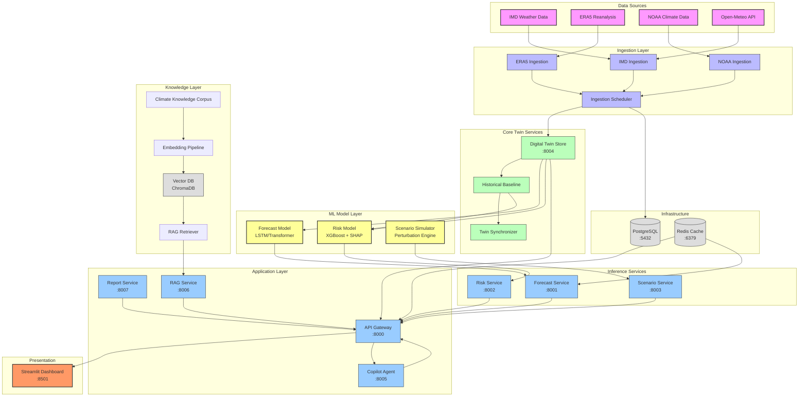
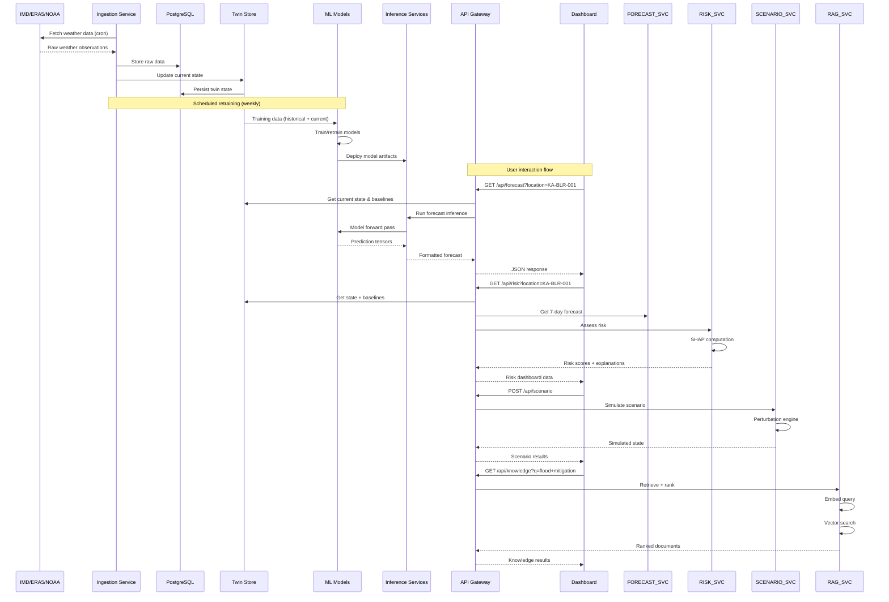
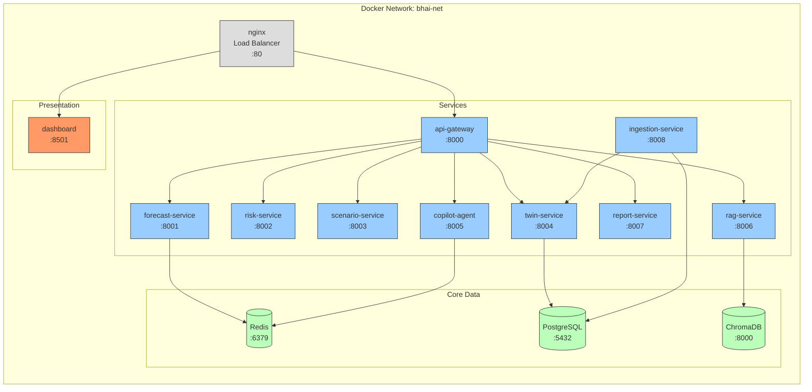
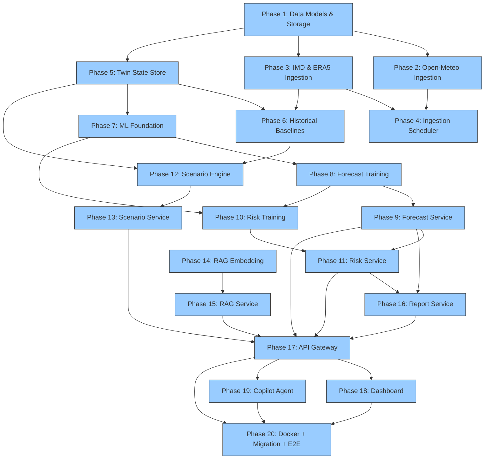

# Climate Digital Twin — Architecture & Implementation Plan

> **For agentic workers:** REQUIRED SUB-SKILL: Use superpowers:subagent-driven-development (recommended) or superpowers:executing-plans to implement this plan phase-by-phase. Phases use checkbox (`- [ ]`) syntax for tracking.

**Goal:** Transform the BHAI repository from an AI Runtime framework with mock climate data into a production-grade Climate Digital Twin with real data ingestion, real ML models, real digital twin state management, and a complete Docker-based microservice architecture.

**Architecture:** The system follows a microservice architecture with 9+ independently deployable services orchestrated by the existing AI Runtime. New components connect to real climate data sources (IMD, ERA5, NOAA), train and serve real ML models (LSTM forecasting, gradient-boosted risk assessment), manage persistent digital twin state, and provide RAG-based knowledge retrieval — all replacing the existing hardcoded mock clients.

**Tech Stack:** Python >=3.11, PyTorch (ML models), XGBoost/LightGBM (risk), FastAPI (service layer), Streamlit (dashboard), PostgreSQL (state store), Redis (cache), ChromaDB (vector store), Docker Compose (orchestration), sentence-transformers (embeddings).

## Global Constraints

- **Runtime architecture is FROZEN** — no redesign of `runtime/` or its models
- All new domain code goes in new top-level directories (`ingestion/`, `models/`, `twin/`, `rag/`, `services/`, `dashboard/`, `infra/`)
- Architecture tests enforce no domain terms in `runtime/` — new code must not import from `runtime/` internals
- Python >=3.11, existing deps (aiohttp, requests, pyyaml, python-dateutil, pydantic) must be preserved
- Every phase must be independently testable
- No mock data in production paths after Phase 20 — all mocks removed
- All ML models must be real (training + inference code, not stubs)
- All data ingestion must connect to real data sources (IMD, ERA5, NOAA, Open-Meteo)
- Must produce a complete `docker-compose.yml` for all services
- New dependencies (numpy, pandas, scikit-learn, torch, xgboost, fastapi, uvicorn, chromadb, sentence-transformers, streamlit, plotly) go in `pyproject.toml`

---

## 1. Architecture Overview

### 1.1 Target System Architecture



### 1.2 End-to-End Data Flow



### 1.3 Service Architecture (Docker)



---

## 2. Directory Structure (Final)

```
bhai/
│
├── pyproject.toml                           # Updated with all dependencies
│
├── runtime/                                 # FROZEN — existing AI Runtime (461 tests)
│   └── ...                                  # No changes allowed
│
├── climate/                                 # MODIFIED — updated providers
│   ├── __init__.py
│   ├── plugin.py                            # Updated to use new services
│   ├── providers/
│   │   ├── forecast.py                      # Rewritten: calls forecast-service:8001
│   │   ├── risk.py                          # Rewritten: calls risk-service:8002
│   │   ├── twin_state.py                    # Rewritten: calls twin-service:8004
│   │   ├── scenario.py                      # Rewritten: calls scenario-service:8003
│   │   ├── knowledge.py                     # Rewritten: calls rag-service:8006
│   │   └── report.py                        # Rewritten: calls report-service:8007
│   ├── pipeline/stages/                     # Unchanged pipeline stages
│   ├── models/                              # Unchanged domain models
│   ├── tests/
│   │   ├── providers/                       # Updated tests (mock HTTP)
│   │   └── ...
│   └── ...
│
├── copilot/
│   └── clients/                             # REMOVED in Phase 20
│
├── ingestion/                               # NEW — Data ingestion pipelines
│   ├── __init__.py
│   ├── models.py                            # Pydantic models for ingested data
│   ├── base.py                              # Base source connector
│   ├── sources/
│   │   ├── __init__.py
│   │   ├── imd.py                           # IMD gridded data connector
│   │   ├── era5.py                          # ERA5 CDS API connector
│   │   ├── noaa.py                          # NOAA NCEI connector
│   │   └── openmeteo.py                     # Open-Meteo free API connector
│   ├── pipeline.py                          # Ingestion pipeline orchestration
│   ├── storage.py                           # Time-series storage layer
│   ├── scheduler.py                         # Scheduled ingestion (APScheduler)
│   └── tests/
│       ├── __init__.py
│       ├── test_imd.py
│       ├── test_era5.py
│       ├── test_pipeline.py
│       └── test_storage.py
│
├── twin/                                    # NEW — Digital Twin State Management
│   ├── __init__.py
│   ├── models.py                            # Pydantic state models
│   ├── store.py                             # Twin state store (PostgreSQL)
│   ├── synchronizer.py                      # Sync from ingestion to twin
│   ├── historical.py                        # 30-year climatological baselines
│   └── tests/
│       ├── __init__.py
│       ├── test_store.py
│       ├── test_synchronizer.py
│       └── test_historical.py
│
├── models/                                  # NEW — ML/AI Models
│   ├── __init__.py
│   ├── base.py                              # Shared base classes
│   ├── features.py                          # Shared feature engineering
│   ├── forecasting/
│   │   ├── __init__.py
│   │   ├── model.py                         # LSTM/Transformer architecture
│   │   ├── trainer.py                       # Training pipeline
│   │   ├── inference.py                     # Inference wrapper
│   │   ├── features.py                      # Forecast-specific features
│   │   └── tests/
│   │       ├── __init__.py
│   │       ├── test_model.py
│   │       ├── test_trainer.py
│   │       └── test_inference.py
│   ├── risk/
│   │   ├── __init__.py
│   │   ├── model.py                         # XGBoost/LightGBM model
│   │   ├── trainer.py                       # Training pipeline
│   │   ├── inference.py                     # Inference with SHAP
│   │   ├── features.py                      # Risk-specific features
│   │   └── tests/
│   │       ├── __init__.py
│   │       ├── test_model.py
│   │       ├── test_trainer.py
│   │       └── test_inference.py
│   ├── scenario/
│   │   ├── __init__.py
│   │   ├── simulator.py                     # Perturbation simulation engine
│   │   ├── perturbations.py                 # Physical perturbation models
│   │   └── tests/
│   │       ├── __init__.py
│   │       └── test_simulator.py
│   └── tests/
│       ├── __init__.py
│       └── test_features.py
│
├── rag/                                     # NEW — RAG/Knowledge System
│   ├── __init__.py
│   ├── embedding.py                         # Embedding pipeline
│   ├── vector_store.py                      # ChromaDB interface
│   ├── retriever.py                         # Hybrid retrieval
│   ├── chunking.py                          # Document chunking
│   ├── documents/                           # Climate knowledge documents
│   │   ├── README.md                        # Source attribution
│   │   └── ... (curated climate docs)
│   └── tests/
│       ├── __init__.py
│       ├── test_embedding.py
│       ├── test_vector_store.py
│       └── test_retriever.py
│
├── services/                                # NEW — Microservice Entry Points
│   ├── __init__.py
│   │
│   ├── api_gateway/                         # Unified API Gateway
│   │   ├── __init__.py
│   │   ├── main.py                          # FastAPI app
│   │   ├── routers/
│   │   │   ├── __init__.py
│   │   │   ├── forecast.py
│   │   │   ├── risk.py
│   │   │   ├── twin.py
│   │   │   ├── scenario.py
│   │   │   ├── knowledge.py
│   │   │   ├── report.py
│   │   │   └── copilot.py
│   │   ├── models.py                        # API response models
│   │   ├── middleware.py                    # Auth, logging, CORS
│   │   └── tests/
│   │       ├── __init__.py
│   │       └── test_api.py
│   │
│   ├── forecast_service/                    # Forecast Model Service
│   │   ├── __init__.py
│   │   ├── main.py                          # FastAPI app
│   │   ├── handler.py                       # Model loading + inference
│   │   └── tests/
│   │
│   ├── risk_service/                        # Risk Assessment Service
│   │   ├── __init__.py
│   │   ├── main.py
│   │   ├── handler.py
│   │   └── tests/
│   │
│   ├── scenario_service/                    # Scenario Simulation Service
│   │   ├── __init__.py
│   │   ├── main.py
│   │   ├── handler.py
│   │   └── tests/
│   │
│   ├── twin_service/                        # Twin State API Service
│   │   ├── __init__.py
│   │   ├── main.py
│   │   ├── handler.py
│   │   └── tests/
│   │
│   ├── rag_service/                         # RAG Knowledge Service
│   │   ├── __init__.py
│   │   ├── main.py
│   │   ├── handler.py
│   │   └── tests/
│   │
│   ├── report_service/                      # Report Generation Service
│   │   ├── __init__.py
│   │   ├── main.py
│   │   ├── handler.py
│   │   ├── templates/                       # Report templates
│   │   └── tests/
│   │
│   ├── copilot_service/                     # Copilot Agent Service
│   │   ├── __init__.py
│   │   ├── main.py
│   │   ├── handler.py                       # Runtime orchestration
│   │   └── tests/
│   │
│   └── ingestion_service/                   # Ingestion Scheduler Service
│       ├── __init__.py
│       ├── main.py
│       └── tests/
│
├── dashboard/                               # NEW — Streamlit Dashboard
│   ├── __init__.py
│   ├── app.py                               # Main entry point
│   ├── config.py                            # Dashboard configuration
│   ├── pages/
│   │   ├── __init__.py
│   │   ├── 01_climate_overview.py           # Climate Overview page
│   │   ├── 02_forecast.py                   # Forecast Viewer page
│   │   ├── 03_twin_state.py                 # Twin State page
│   │   ├── 04_scenario.py                   # Scenario Simulator page
│   │   ├── 05_risk.py                       # Climate Risk page
│   │   ├── 06_reports.py                    # Reports page
│   │   └── 07_copilot.py                    # AI Copilot page
│   ├── components/
│   │   ├── __init__.py
│   │   ├── cards.py                         # Metric cards
│   │   ├── maps.py                          # Map components
│   │   └── charts.py                        # Chart components
│   ├── api_client.py                        # Backend API client
│   └── tests/
│       ├── __init__.py
│       └── test_pages.py
│
├── infra/                                   # NEW — Infrastructure
│   ├── docker/
│   │   ├── docker-compose.yml               # Main production compose
│   │   ├── docker-compose.dev.yml           # Dev overrides
│   │   └── Dockerfile.benchmark             # Existing (unchanged)
│   ├── nginx/
│   │   └── nginx.conf                       # Reverse proxy config
│   ├── monitoring/
│   │   ├── prometheus.yml                   # Prometheus config
│   │   └── grafana/
│   │       └── dashboards/                  # Grafana dashboards
│   └── scripts/
│       ├── init_db.sql                      # PostgreSQL schema
│       └── seed_data.py                     # Dev seed data
│
├── docs/
│   ├── digital_twin_architecture_plan.md    # THIS FILE
│   ├── architecture.md                      # Updated architecture doc
│   ├── deployment.md                        # Updated deployment doc
│   └── ...
│
└── tests/                                    # NEW — End-to-end tests
    ├── __init__.py
    ├── conftest.py                          # E2E test fixtures
    └── test_e2e.py                          # Integration tests
```

---

## 3. Model Registry

### 3.1 Forecasting Model

| Property | Value |
|----------|-------|
| **Type** | Multi-step Time Series Forecasting |
| **Architecture** | LSTM Encoder-Decoder with Attention |
| **Framework** | PyTorch |
| **Input** | `[batch, 90, 5]` — 90-day window of [tmin, tmax, humidity, rainfall, soil_moisture] |
| **Output** | `[batch, 7, 5]` — 7-day forecast of same 5 variables |
| **Loss** | Huber Loss (robust to outliers) |
| **Training Data** | ERA5 + IMD historical (30+ years) |
| **Validation** | Temporal cross-validation (year-by-year) |
| **Retraining** | Weekly (online updates daily) |
| **Explainability** | Attention weights visualization |
| **Serving** | ONNX Runtime or TorchScript |

### 3.2 Risk Assessment Model

| Property | Value |
|----------|-------|
| **Type** | Multi-target Regression + Classification |
| **Architecture** | XGBoost Regressor ensemble (4 targets) |
| **Framework** | XGBoost + scikit-learn |
| **Input** | ~20 features: current state (5), 7-day forecast (35), historical baselines (6), location (3), seasonal (3) |
| **Output** | composite_risk [0,1], heat_risk [0,1], flood_risk [0,1], drought_risk [0,1], category [enum] |
| **Training Data** | Historical events + labeled risk assessments |
| **Explainability** | SHAP values per prediction (TreeExplainer) |
| **Retraining** | Monthly |
| **Serving** | XGBoost native predict |

### 3.3 Scenario Simulator

| Property | Value |
|----------|-------|
| **Type** | Physics-informed Perturbation Engine |
| **Architecture** | Delta-method on historical baselines + physically-based parameterizations |
| **Framework** | Pure Python + numpy |
| **Input** | scenario_type [temperature, rainfall, extreme_event, monsoon], delta_value, location, duration_days |
| **Output** | Perturbed 90-day time series for all weather variables |
| **Key Models** | Temperature perturbation (uniform + diurnal), Rainfall perturbation (multiplicative), Heatwave model (threshold exceedance), Monsoon shift (temporal offset) |
| **Validation** | Against historical analogs (e.g., compare +2°C scenario to warmest years) |

### 3.4 Embedding Model (RAG)

| Property | Value |
|----------|-------|
| **Type** | Sentence Transformer |
| **Architecture** | all-MiniLM-L6-v2 (384-dim) |
| **Framework** | sentence-transformers |
| **Store** | ChromaDB (production: FAISS + PostgreSQL) |
| **Retrieval** | Hybrid: dense (cosine similarity) + sparse (BM25) |
| **Chunking** | RecursiveCharacterTextSplitter, 500 chars, 50 overlap |
| **Documents** | Climate reports, IPCC summaries, regional climate profiles |

---

## 4. Phase Breakdown (20 Phases)

---

### Phase 1: Data Models & Storage Layer

**Objective:** Create the shared data models and time-series storage abstraction that all ingestion pipelines will use.

**Dependencies:** None (foundation phase)

**Files to create:**
- `ingestion/__init__.py`
- `ingestion/models.py` — Pydantic models for raw weather observations, station metadata
- `ingestion/base.py` — Abstract base class for data source connectors
- `ingestion/storage.py` — Time-series storage layer (SQLite for dev, PostgreSQL-compatible interface)
- `ingestion/tests/__init__.py`
- `ingestion/tests/test_storage.py`

**Subsystems affected:** ingestion/

**Test requirements:**
- Storage CRUD operations work for time-series data
- Models validate correctly (location, timestamp, variable constraints)
- Base class enforces interface contract
- SQLite mode works without external DB

**Estimated effort:** Medium

---

### Phase 2: Open-Meteo Data Ingestion

**Objective:** Implement the first real data connector — Open-Meteo (free, no API key needed) for current weather and historical data.

**Dependencies:** Phase 1

**Files to create:**
- `ingestion/sources/__init__.py`
- `ingestion/sources/openmeteo.py` — Open-Meteo API connector (async)
- `ingestion/pipeline.py` — Ingestion pipeline orchestration
- `ingestion/tests/test_pipeline.py`

**Files to modify:**
- `pyproject.toml` — add dependencies (no new deps needed — uses aiohttp which already exists)

**Subsystems affected:** ingestion/

**Test requirements:**
- Connector fetches real data from Open-Meteo API (integration test, skip if no network)
- Pipeline stores data via storage layer
- Error handling for network failures and malformed responses
- Rate limiting compliance

**Estimated effort:** Medium

---

### Phase 3: IMD & ERA5 Data Ingestion

**Objective:** Connect to IMD data portal and Copernicus ERA5 CDS API for historical climate data.

**Dependencies:** Phase 1

**Files to create:**
- `ingestion/sources/imd.py` — IMD data.gov.in / MOSDAC connector
- `ingestion/sources/era5.py` — ERA5 CDS API connector
- `ingestion/sources/noaa.py` — NOAA NCEI API connector
- `ingestion/tests/test_imd.py`
- `ingestion/tests/test_era5.py`
- `ingestion/tests/test_noaa.py`

**Files to modify:**
- `pyproject.toml` — add `cdsapi` dependency (ERA5 requires this)

**Subsystems affected:** ingestion/

**Test requirements:**
- IMD connector fetches real gridded data (integration)
- ERA5 connector interfaces with CDS API correctly
- Connectors fail gracefully with informative errors when APIs are unreachable
- Offline tests with cached/example responses

**Estimated effort:** Medium

---

### Phase 4: Ingestion Scheduler

**Objective:** Create the scheduled ingestion service that runs data collection on configurable intervals.

**Dependencies:** Phases 2, 3

**Files to create:**
- `ingestion/scheduler.py` — APScheduler-based ingestion orchestrator
- `ingestion_service/__init__.py`
- `ingestion_service/main.py` — Standalone entry point for containerized ingestion

**Files to modify:**
- `pyproject.toml` — add `apscheduler`, `fastapi`, `uvicorn` dependencies

**Subsystems affected:** ingestion/, services/ingestion_service/

**Test requirements:**
- Scheduler correctly invokes configured pipelines
- Config file parsing (YAML/JSON) for source schedules
- Graceful shutdown on SIGTERM
- No duplicate ingestion for same time window

**Estimated effort:** Small

---

### Phase 5: Digital Twin State Store

**Objective:** Create the persistent twin state management — replacing the hardcoded `TwinClient` with a real database-backed state store.

**Dependencies:** Phase 1

**Files to create:**
- `twin/__init__.py`
- `twin/models.py` — Pydantic models for twin state (current conditions, location metadata)
- `twin/store.py` — PostgreSQL-backed state store with SQLite fallback for dev
- `twin/tests/__init__.py`
- `twin/tests/test_store.py`

**Subsystems affected:** twin/

**Test requirements:**
- Store CRUD operations for location state
- Bulk update from ingestion pipeline
- Query by location, time range, variable
- SQLite mode works without PostgreSQL
- Thread-safe concurrent access

**Estimated effort:** Medium

---

### Phase 6: Historical Baseline Service

**Objective:** Compute and serve 30-year climatological normal periods (temperature, rainfall, humidity baselines by location/season).

**Dependencies:** Phases 3, 5

**Files to create:**
- `twin/historical.py` — Baseline computation from ERA5/IMD historical data
- `twin/synchronizer.py` — Syncs ingestion data into twin state store
- `twin/tests/test_historical.py`
- `twin/tests/test_synchronizer.py`

**Subsystems affected:** twin/

**Test requirements:**
- Baseline computation produces correct 30-year means
- Anomaly detection (current vs baseline) works correctly
- Synchronizer merges new ingestion data into twin store without duplicates
- Baseline tables are populated correctly

**Estimated effort:** Medium

---

### Phase 7: ML Foundation & Feature Engineering

**Objective:** Create the shared ML infrastructure — base classes, feature engineering utilities, dataset management.

**Dependencies:** Phase 5

**Files to create:**
- `models/__init__.py`
- `models/base.py` — Base trainer/inference classes
- `models/features.py` — Shared feature engineering (lag features, rolling windows, seasonal decomposers)
- `models/tests/__init__.py`
- `models/tests/test_features.py`

**Files to modify:**
- `pyproject.toml` — add `numpy`, `pandas`, `scikit-learn`, `torch` dependencies

**Subsystems affected:** models/

**Test requirements:**
- Feature engineering produces correct shapes and value ranges
- Lag/rolling window features match expected values
- Seasonal decomposition works on synthetic data
- Base classes enforce interface contracts correctly

**Estimated effort:** Medium

---

### Phase 8: Forecasting Model — Training Pipeline

**Objective:** Build and train a real LSTM/Transformer model for multi-step climate forecasting using historical data.

**Dependencies:** Phases 5, 7

**Files to create:**
- `models/forecasting/__init__.py`
- `models/forecasting/model.py` — LSTM Encoder-Decoder with Attention (PyTorch `nn.Module`)
- `models/forecasting/features.py` — Forecast-specific feature engineering
- `models/forecasting/trainer.py` — Training loop with temporal cross-validation
- `models/forecasting/tests/__init__.py`
- `models/forecasting/tests/test_model.py`
- `models/forecasting/tests/test_trainer.py`

**Subsystems affected:** models/forecasting/

**Test requirements:**
- Model forward pass produces correct output shape: `[batch, 7, 5]`
- Training runs on synthetic data without errors
- Loss decreases over epochs
- Model checkpointing/loading works correctly
- Temporal cross-validation splits preserve time ordering

**Estimated effort:** Large

---

### Phase 9: Forecasting Inference Service

**Objective:** Deploy the trained forecast model as a FastAPI microservice.

**Dependencies:** Phase 8

**Files to create:**
- `models/forecasting/inference.py` — Inference wrapper with model loading
- `services/forecast_service/__init__.py`
- `services/forecast_service/main.py` — FastAPI with `/predict` endpoint
- `services/forecast_service/handler.py` — Request parsing, model inference, response formatting
- `services/forecast_service/tests/__init__.py`
- `services/forecast_service/tests/test_api.py`

**Subsystems affected:** models/forecasting/, services/forecast_service/

**Test requirements:**
- `/predict` endpoint returns valid forecast for valid input
- Invalid inputs return proper 422 errors
- Model loading from checkpoint works
- Health check endpoint returns OK
- Concurrent requests don't crash

**Estimated effort:** Medium

---

### Phase 10: Risk Assessment Model — Training & Inference

**Objective:** Build, train, and serve an XGBoost-based risk assessment model with SHAP explainability.

**Dependencies:** Phases 5, 7, 9

**Files to create:**
- `models/risk/__init__.py`
- `models/risk/model.py` — XGBoost ensemble model definition
- `models/risk/features.py` — Risk-specific features (current + forecast + baselines + location + seasonal)
- `models/risk/trainer.py` — Training pipeline with synthetic risk label generation
- `models/risk/inference.py` — Inference with SHAP explanation computation
- `models/risk/tests/__init__.py`
- `models/risk/tests/test_model.py`
- `models/risk/tests/test_trainer.py`
- `models/risk/tests/test_inference.py`

**Subsystems affected:** models/risk/

**Test requirements:**
- Model produces 4 risk scores in [0,1] range
- SHAP values are computed correctly (sum matches prediction)
- Training converges on synthetic data
- Category classification matches risk score thresholds
- Feature importance ranks are non-empty

**Estimated effort:** Large

---

### Phase 11: Risk Service

**Objective:** Deploy risk model as a FastAPI microservice with SHAP explanations.

**Dependencies:** Phase 10

**Files to create:**
- `services/risk_service/__init__.py`
- `services/risk_service/main.py` — FastAPI with `/assess` and `/explain` endpoints
- `services/risk_service/handler.py` — Request parsing, feature assembly, inference
- `services/risk_service/tests/__init__.py`
- `services/risk_service/tests/test_api.py`

**Subsystems affected:** services/risk_service/

**Test requirements:**
- `/assess` returns composite + per-category risk scores
- `/explain` returns SHAP values and feature names
- Invalid inputs return proper errors
- Health check works

**Estimated effort:** Small

---

### Phase 12: Scenario Simulation Engine

**Objective:** Build the physics-informed scenario simulation engine (replaces external POST dependency).

**Dependencies:** Phases 5, 6

**Files to create:**
- `models/scenario/__init__.py`
- `models/scenario/perturbations.py` — Perturbation models (temperature delta, rainfall multiplier, heatwave, monsoon shift)
- `models/scenario/simulator.py` — Simulation orchestrator
- `models/scenario/tests/__init__.py`
- `models/scenario/tests/test_simulator.py`

**Subsystems affected:** models/scenario/

**Test requirements:**
- Temperature perturbation correctly shifts values by delta
- Rainfall perturbation applies multiplicative factor
- Heatwave scenario generates days exceeding threshold
- Monsoon shift modifies rainfall temporal distribution
- Scenario output preserves physical constraints (humidity bounds, etc.)

**Estimated effort:** Medium

---

### Phase 13: Scenario Simulation Service

**Objective:** Deploy the scenario engine as a FastAPI microservice.

**Dependencies:** Phase 12

**Files to create:**
- `services/scenario_service/__init__.py`
- `services/scenario_service/main.py` — FastAPI with `/simulate` endpoint
- `services/scenario_service/handler.py`
- `services/scenario_service/tests/__init__.py`
- `services/scenario_service/tests/test_api.py`

**Subsystems affected:** services/scenario_service/

**Test requirements:**
- `/simulate` returns perturbed time series
- All scenario types can be computed
- Validation ensures parameters are in valid ranges

**Estimated effort:** Small

---

### Phase 14: RAG — Embedding Pipeline & Vector Store

**Objective:** Build the embedding pipeline and vector database for climate knowledge retrieval.

**Dependencies:** None (self-contained)

**Files to create:**
- `rag/__init__.py`
- `rag/embedding.py` — Sentence transformer embedding pipeline
- `rag/vector_store.py` — ChromaDB interface (add, query, delete collections)
- `rag/chunking.py` — Recursive text chunking with overlap
- `rag/tests/__init__.py`
- `rag/tests/test_embedding.py`
- `rag/tests/test_vector_store.py`

**Files to modify:**
- `pyproject.toml` — add `chromadb`, `sentence-transformers` dependencies

**Subsystems affected:** rag/

**Test requirements:**
- Embedding produces correct vector dimensions
- ChromaDB CRUD operations work
- Chunking splits documents correctly with overlap
- Hybrid search (dense + sparse) returns ranked results
- Collection management (create, delete, list) works

**Estimated effort:** Medium

---

### Phase 15: RAG — Climate Knowledge Corpus & Retrieval Service

**Objective:** Curate climate knowledge documents and deploy the RAG retrieval service.

**Dependencies:** Phase 14

**Files to create:**
- `rag/retriever.py` — Hybrid retrieval (dense vector + BM25)
- `rag/documents/README.md` — Source list and attribution
- `services/rag_service/__init__.py`
- `services/rag_service/main.py` — FastAPI with `/search` endpoint
- `services/rag_service/handler.py`
- `services/rag_service/tests/__init__.py`
- `services/rag_service/tests/test_api.py`
- `scripts/ingest_documents.py` — Document indexing script

**Subsystems affected:** rag/, services/rag_service/

**Test requirements:**
- `/search` returns ranked documents with relevance scores
- Documents can be indexed and searched
- Empty query returns informative error
- Retrieved documents have correct metadata

**Estimated effort:** Medium

---

### Phase 16: Report Generation Service

**Objective:** Build the report generation service using templates and LLM enhancement.

**Dependencies:** Phases 5, 6, 9, 11 (needs forecast + risk services for data)

**Files to create:**
- `services/report_service/__init__.py`
- `services/report_service/main.py` — FastAPI with `/generate` endpoint
- `services/report_service/handler.py` — Report composition from multiple data sources
- `services/report_service/templates/` — Jinja2 report templates
- `services/report_service/tests/__init__.py`
- `services/report_service/tests/test_api.py`

**Subsystems affected:** services/report_service/

**Test requirements:**
- Report generated with all required sections
- Template rendering produces valid output
- Missing data sections gracefully omitted
- LLM enhancement adds analysis (if Ollama available)

**Estimated effort:** Medium

---

### Phase 17: API Gateway

**Objective:** Create the unified FastAPI API gateway that aggregates all microservices.

**Dependencies:** Phases 9, 11, 13, 15, 16 (needs service contracts)

**Files to create:**
- `services/api_gateway/__init__.py`
- `services/api_gateway/main.py` — FastAPI app with all routers
- `services/api_gateway/routers/__init__.py`
- `services/api_gateway/routers/forecast.py` — Proxy to forecast-service
- `services/api_gateway/routers/risk.py` — Proxy to risk-service
- `services/api_gateway/routers/twin.py` — Proxy to twin-service
- `services/api_gateway/routers/scenario.py` — Proxy to scenario-service
- `services/api_gateway/routers/knowledge.py` — Proxy to rag-service
- `services/api_gateway/routers/report.py` — Proxy to report-service
- `services/api_gateway/routers/copilot.py` — Proxy to copilot-agent
- `services/api_gateway/models.py` — Unified response models
- `services/api_gateway/middleware.py` — CORS, logging, rate limiting
- `services/api_gateway/tests/__init__.py`
- `services/api_gateway/tests/test_api.py`

**Subsystems affected:** services/api_gateway/

**Test requirements:**
- All endpoints return correct data
- Proxy routing works for each service
- Middleware (CORS, logging) is active
- Error responses are consistent format
- Health endpoint aggregates downstream health

**Estimated effort:** Large

---

### Phase 18: Streamlit Dashboard

**Objective:** Build the full Streamlit dashboard matching the existing screenshots and page designs.

**Dependencies:** Phase 17 (API Gateway must be available)

**Files to create:**
- `dashboard/__init__.py`
- `dashboard/app.py` — Main Streamlit app with navigation
- `dashboard/config.py` — API URL, theme config
- `dashboard/api_client.py` — Async HTTP client for API Gateway
- `dashboard/pages/__init__.py`
- `dashboard/pages/01_climate_overview.py` — Overview with key metrics
- `dashboard/pages/02_forecast.py` — Forecast charts
- `dashboard/pages/03_twin_state.py` — Current state display
- `dashboard/pages/04_scenario.py` — Scenario simulator controls
- `dashboard/pages/05_risk.py` — Risk maps and charts
- `dashboard/pages/06_reports.py` — Report generation
- `dashboard/pages/07_copilot.py` — Chat interface
- `dashboard/components/__init__.py`
- `dashboard/components/cards.py` — Metric cards
- `dashboard/components/maps.py` — Folium/Mapbox maps
- `dashboard/components/charts.py` — Plotly charts
- `dashboard/tests/__init__.py`
- `dashboard/tests/test_pages.py`

**Files to modify:**
- `pyproject.toml` — add `streamlit`, `plotly`, `folium`, `streamlit-folium` dependencies

**Subsystems affected:** dashboard/

**Test requirements:**
- App starts without errors
- Navigation works across all 7 pages
- API client handles errors gracefully (fallback banners)
- Charts render with sample data
- Responsive layout works

**Estimated effort:** XLarge

---

### Phase 19: Copilot Agent Service

**Objective:** Build the LLM-powered chat agent that uses the Runtime to answer climate questions.

**Dependencies:** Phase 17 (needs API Gateway to call services)

**Files to create:**
- `services/copilot_service/__init__.py`
- `services/copilot_service/main.py` — FastAPI with `/ask` endpoint
- `services/copilot_service/handler.py` — Runtime orchestration for Q&A
- `services/copilot_service/tests/__init__.py`
- `services/copilot_service/tests/test_api.py`

**Subsystems affected:** services/copilot_service/

**Test requirements:**
- `/ask` returns answer with citations
- Conversation context is preserved
- Runtime pipeline executes correctly
- Fallback responses when services unavailable

**Estimated effort:** Large

---

### Phase 20: Docker Compose, Provider Migration & E2E Tests

**Objective:** Create complete Docker infrastructure, migrate old provider adapters to use real services, run end-to-end tests.

**Dependencies:** All previous phases

**Files to create:**
- `infra/docker/docker-compose.yml` — All services
- `infra/docker/docker-compose.dev.yml` — Dev overrides with hot-reload
- `infra/nginx/nginx.conf` — Reverse proxy configuration
- `infra/scripts/init_db.sql` — PostgreSQL schema initialization
- `infra/scripts/seed_data.py` — Development seed data
- `tests/__init__.py`
- `tests/conftest.py` — E2E test fixtures (Docker Compose lifecycle)
- `tests/test_e2e.py` — End-to-end integration tests
- `infra/monitoring/prometheus.yml` — Prometheus config
- `infra/monitoring/grafana/dashboards/` — Grafana dashboards

**Files to modify:**
- `climate/providers/forecast.py` — Rewritten: calls `forecast-service:8001` instead of mock
- `climate/providers/risk.py` — Rewritten: calls `risk-service:8002`
- `climate/providers/twin_state.py` — Rewritten: calls `twin-service:8004`
- `climate/providers/scenario.py` — Rewritten: calls `scenario-service:8003`
- `climate/providers/knowledge.py` — Rewritten: calls `rag-service:8006`
- `climate/providers/report.py` — Rewritten: calls `report-service:8007`
- `climate/plugin.py` — Remove migration wrappers, update provider configs
- `copilot/clients/` — REMOVE all mock client files
- `pyproject.toml` — Final dependency list
- `runtime/test_architecture.py` — Add arch test exemptions if needed
- `docs/architecture.md` — Update with new components
- `docs/deployment.md` — Update with Docker instructions
- `STATE.md` — Mark Phase 4 as complete

**Subsystems affected:** ALL

**Test requirements:**
- `docker-compose up` starts all services
- Health checks pass for every service
- End-to-end data flow: ingestion -> twin -> forecast -> risk -> dashboard
- All 461 existing Runtime tests still pass
- Architecture tests still enforce domain isolation
- Provider adapters return real data from services
- Dashboard renders with real data

**Estimated effort:** XLarge

---

## 5. Dependency Graph



---

## 6. Parallelization Opportunities

The following phases can be implemented in parallel by different agents:

| Track 1 (Data/Ingestion) | Track 2 (Twin/State) | Track 3 (ML/Models) | Track 4 (Knowledge) | Track 5 (Services) |
|---|---|---|---|---|
| Phase 1 | | | | |
| Phase 2 | Phase 5 | | Phase 14 | |
| Phase 3 | Phase 6 | Phase 7 | Phase 14 cont. | |
| Phase 4 | | Phase 8 | Phase 15 | |
| | | Phase 10 | | |
| | | Phase 9, 11, 12, 13 | | Phase 16, 17, 18, 19 |

---

## 7. Risk Assessment

| Risk | Likelihood | Impact | Mitigation |
|------|-----------|--------|------------|
| **IMD/ERA5 API access issues** (registration delays, rate limits, downtime) | Medium | High | Phase 2 (Open-Meteo) first as fallback; cache responses; use synthetic data for dev |
| **ML model convergence failure** (model doesn't learn meaningful patterns) | Medium | High | Extensive unit tests on synthetic data; simpler baseline models (persistence, climatology) as fallbacks |
| **Runtime architecture constraints** (new code accidentally imports from runtime/) | Low | Medium | Architecture tests already exist; CI pipeline catches violations |
| **Dependency conflicts** (torch, numpy versions conflict with existing deps) | Low | Medium | Pin versions in pyproject.toml; test in isolated Docker first |
| **Dashboard pages too large for single agent session** | High | Medium | Split Phase 18 into 3 sub-phases if needed; each page is independently developable |
| **PostgreSQL schema migrations across phases** | Medium | Low | Use SQLite for early phases; define final schema in Phase 1; Alembic migrations in Phase 20 |
| **LLM integration failure** (Ollama not available, API changes) | Low | Medium | Fallback to template-based reports; mock LLM responses in tests |
| **Vector DB performance issues** (ChromaDB not suitable for production) | Low | Medium | Abstract ChromaDB behind interface in Phase 14; swap to FAISS+PG in Phase 20 if needed |

---

## 8. Key Interfaces & Contracts

### 8.1 Data Source Connector Contract

```python
class DataSourceConnector(ABC):
    """Base class for all ingestion data sources."""
    
    @abstractmethod
    async def fetch_current(self, location: str) -> WeatherObservation:
        """Fetch current conditions for a location."""
    
    @abstractmethod
    async def fetch_historical(
        self, location: str, start_date: date, end_date: date
    ) -> list[WeatherObservation]:
        """Fetch historical observations for a time range."""
    
    @abstractmethod
    async def health(self) -> bool:
        """Check if the data source is reachable."""
```

### 8.2 Provider Adapter Contract (Post-Migration)

```python
class ForecastProviderAdapter(Provider):
    """Updated: calls forecast-service instead of mock."""
    
    async def execute(self, request: ProviderRequest) -> ProviderResult:
        # Calls http://forecast-service:8001/predict
        # with request.params as JSON body
```

### 8.3 API Gateway Contract

```python
# All endpoints return unified response format:
{
    "status": "success" | "error",
    "data": { ... },  # Actual response data
    "error": null | { "code": str, "message": str },
    "meta": {
        "request_id": str,
        "timestamp": str,
        "service_version": str
    }
}
```

### 8.4 Service-to-Service Headers

```python
# All internal requests carry:
X-Request-ID: str       # Trace ID for request correlation
X-Service-Name: str     # Originating service
X-Api-Version: str      # API version for backward compatibility
```

---

## 9. Dependency Summary

### New Dependencies (in order of introduction)

| Dependency | Phase | Version | Purpose |
|-----------|-------|---------|---------|
| `apscheduler` | 4 | >=3.10 | Ingestion scheduling |
| `fastapi` | 4 | >=0.109 | Service entry points |
| `uvicorn` | 4 | >=0.27 | ASGI server |
| `numpy` | 7 | >=1.24 | Numerical computing |
| `pandas` | 7 | >=2.0 | Data manipulation |
| `scikit-learn` | 7 | >=1.3 | ML utilities |
| `torch` | 8 | >=2.1 | Deep learning |
| `xgboost` | 10 | >=2.0 | Gradient boosting |
| `shap` | 10 | >=0.44 | Model explainability |
| `sentence-transformers` | 14 | >=2.2 | Text embeddings |
| `chromadb` | 14 | >=0.4 | Vector database |
| `streamlit` | 18 | >=1.31 | Dashboard |
| `plotly` | 18 | >=5.18 | Interactive charts |
| `folium` | 18 | >=0.16 | Maps |
| `streamlit-folium` | 18 | >=0.20 | Streamlit maps integration |
| `jinja2` | 16 | >=3.1 | Report templates |
| `httpx` | 5 | >=0.25 | Async HTTP for service calls |
| `psycopg2-binary` | 5 | >=2.9 | PostgreSQL driver |
| `alembic` | 20 | >=1.13 | DB migrations |

### Final pyproject.toml `[project.dependencies]` section:

```toml
dependencies = [
    # Existing
    "aiohttp>=3.9,<4.0",
    "requests>=2.31",
    "pyyaml>=6.0",
    "python-dateutil>=2.8",
    "pydantic>=2.0,<3.0",
    # New — Infrastructure
    "fastapi>=0.109,<1.0",
    "uvicorn>=0.27,<1.0",
    "apscheduler>=3.10,<4.0",
    "httpx>=0.25,<1.0",
    "psycopg2-binary>=2.9,<3.0",
    "alembic>=1.13,<2.0",
    "jinja2>=3.1,<4.0",
    # New — Scientific Computing
    "numpy>=1.24,<2.0",
    "pandas>=2.0,<3.0",
    "scikit-learn>=1.3,<2.0",
    # New — ML Models
    "torch>=2.1,<3.0",
    "xgboost>=2.0,<3.0",
    "shap>=0.44,<1.0",
    # New — RAG
    "sentence-transformers>=2.2,<3.0",
    "chromadb>=0.4,<1.0",
    # New — Dashboard
    "streamlit>=1.31,<2.0",
    "plotly>=5.18,<7.0",
    "folium>=0.16,<1.0",
    "streamlit-folium>=0.20,<1.0",
]
```

---

## 10. Pre-Phase Checklist

Before starting Phase 1, verify:

- [ ] Existing Runtime tests pass (461 tests, 0 failures)
- [ ] Architecture tests pass (24/24)
- [ ] `git status` is clean
- [ ] No uncommitted changes
- [ ] Python >=3.11 is available
- [ ] `pip install -e ".[dev]"` works without errors
- [ ] `pytest runtime/ climate/ -q` passes
- [ ] `docs/` directory exists

---

## Execution Handoff

**Plan complete and saved to `docs/digital_twin_architecture_plan.md`.**

Two execution options:

**1. Subagent-Driven (recommended)** — Dispatch a fresh agent per phase, review between phases, fast iteration. Each phase produces independently testable software.

**2. Inline Execution** — Execute phases sequentially in this session using executing-plans, with checkpoints for review.

**Which approach?**
