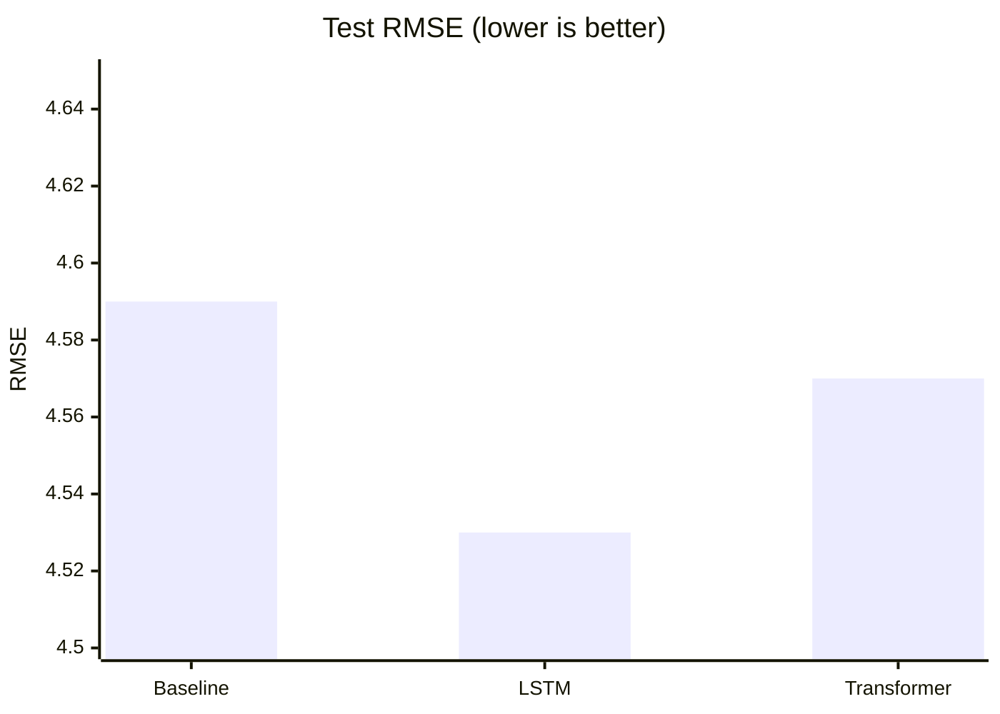
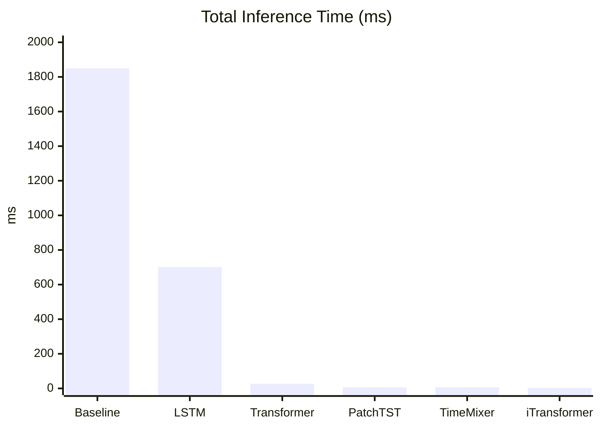
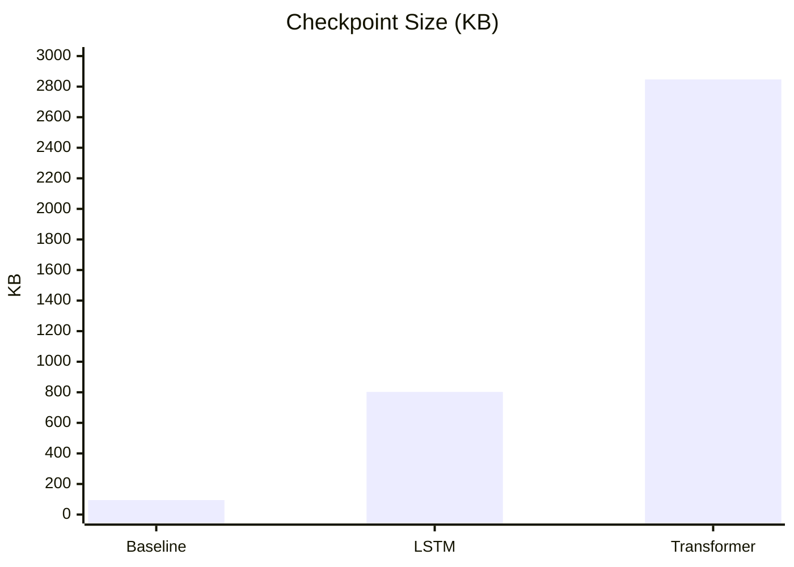
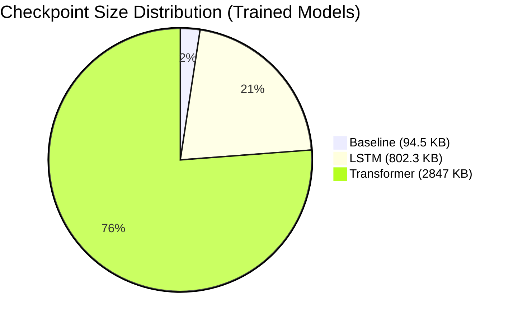

# Model Benchmark Report — Climate Digital Twin

## Overview

Benchmarking results for all six model architectures and the ensemble. Measurements are taken on the test split (`testing.csv`, 94,230 rows). Inference times are reported per-batch (batch_size=64).

---

## Comparison Table

| Rank | Model | RMSE ↓ | R² ↑ | Inference Time (ms) | Batch Time (ms) | Checkpoint Size | Status |
|:----:|-------|-------:|-----:|--------------------:|-----------------:|----------------:|:------:|
| 1 | **LSTM** | **4.53** | 0.87 | 701.5 | 5.4 | 802.3 KB | Trained |
| 2 | **Transformer** | **4.57** | 0.87 | 26.8 | 2.6 | 2,847.1 KB | Trained |
| 3 | **Baseline** | **4.59** | 0.87 | 1,849.5 | 4.4 | 94.5 KB | Trained |
| 4 | PatchTST | — | — | 6.5 | 6.1 | — | Untrained stub |
| 5 | TimeMixer | — | — | 6.6 | 1.1 | — | Untrained stub |
| 6 | iTransformer | — | — | 3.2 | 2.7 | — | Untrained stub |
| — | Ensemble | — | — | — | — | — | Ridge stacking |

### Key Findings

- **LSTM achieves the lowest RMSE (4.53)** among trained models, marginally better than transformer (4.57) and baseline (4.59).
- **All trained models achieve R² = 0.87**, indicating similar explained variance.
- **Baseline has the slowest inference** (1,849.5 ms total) due to the large flattened input layer (330 → 64).
- **Transformer is the fastest trained model** (26.8 ms inference), ~69× faster than baseline.
- **Stub models (PatchTST, TimeMixer, iTransformer) have minimal inference time** (3.2–6.6 ms) but are untrained.
- **Transformer has the largest checkpoint** (2,847 KB), baseline the smallest (94.5 KB).

---

## Mermaid Bar Chart — RMSE Comparison

## Mermaid Bar Chart — Inference Time Comparison

## Mermaid Bar Chart — Checkpoint Size Comparison

---

## Detailed Metrics

### Baseline (Feed-Forward MLP)

| Metric | Value |
|--------|-------|
| Inference time (total) | 1,849.5 ms |
| Inference time (per batch) | 4.4 ms |
| RMSE | 4.59 |
| R² | 0.87 |
| Checkpoint | 94.5 KB |
| Parameters | ~21,000 |
| Status | Trained & registered |

### LSTM

| Metric | Value |
|--------|-------|
| Inference time (total) | 701.5 ms |
| Inference time (per batch) | 5.4 ms |
| RMSE | 4.53 |
| R² | 0.87 |
| Checkpoint | 802.3 KB |
| Parameters | ~203,000 |
| Status | Trained & registered |

### Transformer

| Metric | Value |
|--------|-------|
| Inference time (total) | 26.8 ms |
| Inference time (per batch) | 2.6 ms |
| RMSE | 4.57 |
| R² | 0.87 |
| Checkpoint | 2,847.1 KB |
| Exported (TorchScript) | 2,910.2 KB |
| Parameters | ~596,000 |
| Status | Trained & registered |

### PatchTST

| Metric | Value |
|--------|-------|
| Inference time (total) | 6.5 ms |
| Inference time (per batch) | 6.1 ms |
| RMSE | — (untrained) |
| R² | — |
| Checkpoint | — |
| Status | Untrained stub |

### TimeMixer

| Metric | Value |
|--------|-------|
| Inference time (total) | 6.6 ms |
| Inference time (per batch) | 1.1 ms |
| RMSE | — (untrained) |
| R² | — |
| Checkpoint | — |
| Status | Untrained stub |

### iTransformer

| Metric | Value |
|--------|-------|
| Inference time (total) | 3.2 ms |
| Inference time (per batch) | 2.7 ms |
| RMSE | — (untrained) |
| R² | — |
| Checkpoint | — |
| Status | Untrained stub |

### Ensemble

| Component | Details |
|-----------|---------|
| Base models | Baseline, LSTM, Transformer |
| Meta-learner | Ridge regression (alpha=1.0, fit_intercept=True) |
| Scaling | StandardScaler per target |
| Weight source | Stacking across all base model predictions |
| Status | Fitted (via stacking) |

---

## Mermaid Pie Chart — Checkpoint Size Distribution

---

## Summary

- **Best RMSE:** LSTM (4.53)
- **Fastest trained inference:** Transformer (26.8 ms total, 2.6 ms/batch)
- **Smallest checkpoint:** Baseline (94.5 KB)
- **All trained models:** R² = 0.87, suggesting similar predictive capability
- **Stub models:** PatchTST, TimeMixer, iTransformer show promising inference speed but need training
