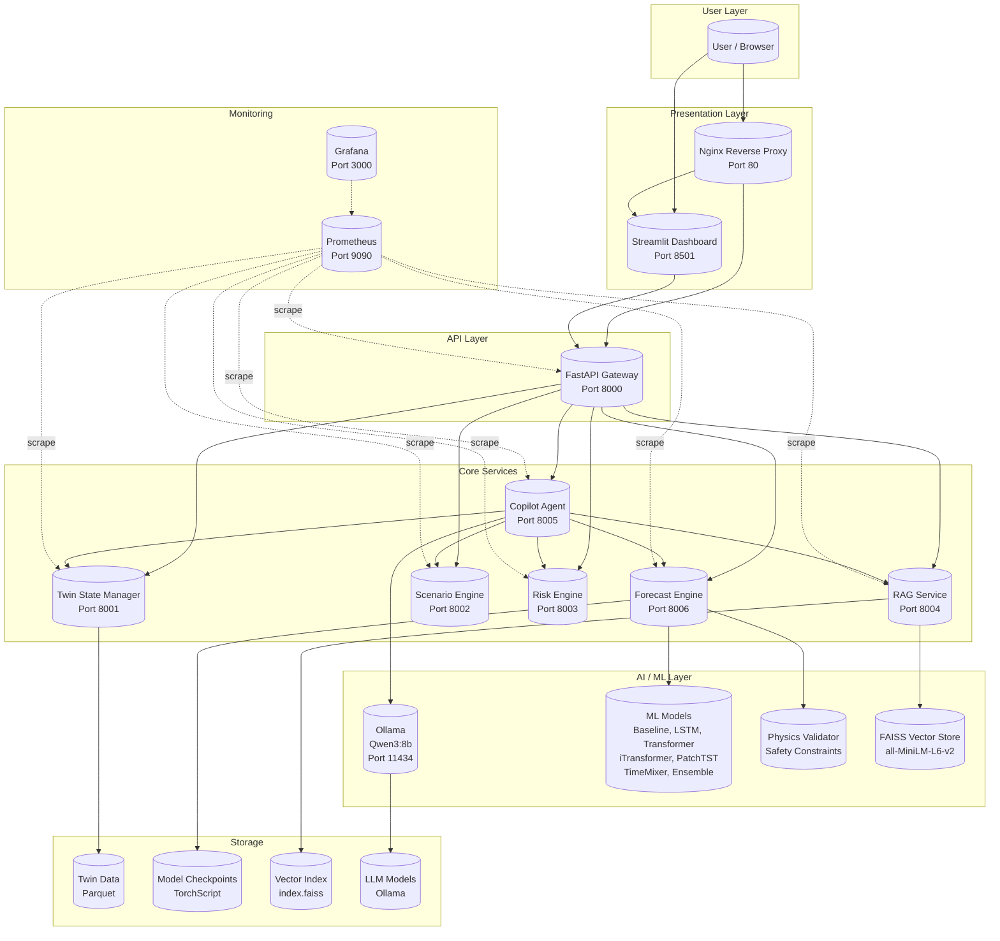
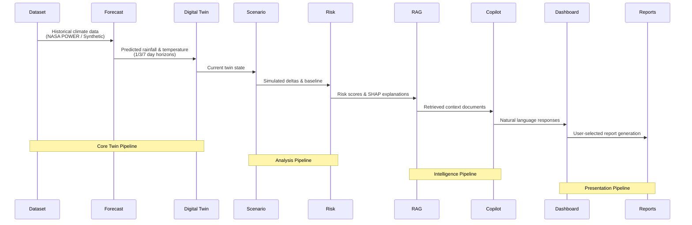
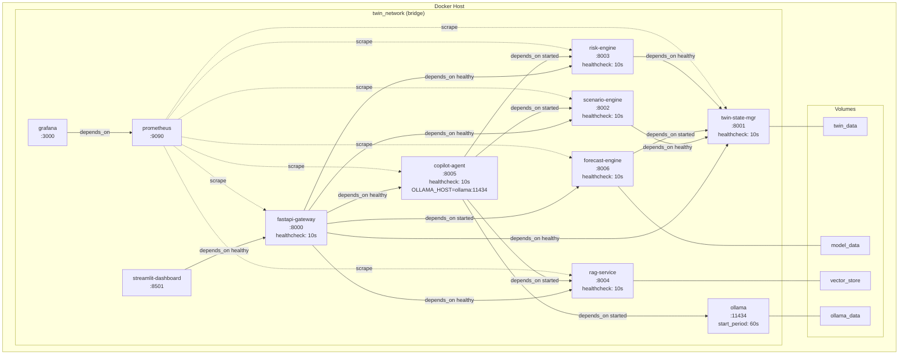
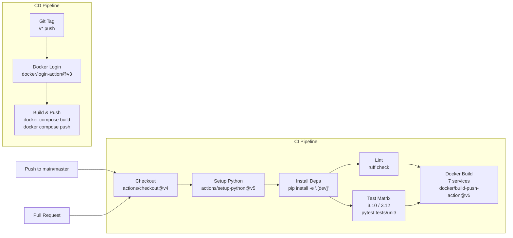

# Architecture Diagrams

## 1. System Architecture

```mermaid
graph TD
    subgraph "User Layer"
        USER[("User / Browser")]
    end

    subgraph "Presentation Layer"
        DASH[("Streamlit Dashboard<br/>Port 8501")]
        NGINX[("Nginx Reverse Proxy<br/>Port 80")]
    end

    subgraph "API Layer"
        GW[("FastAPI Gateway<br/>Port 8000")]
    end

    subgraph "Core Services"
        TWIN[("Twin State Manager<br/>Port 8001")]
        FC[("Forecast Engine<br/>Port 8006")]
        SC[("Scenario Engine<br/>Port 8002")]
        RSK[("Risk Engine<br/>Port 8003")]
        RAG[("RAG Service<br/>Port 8004")]
        COP[("Copilot Agent<br/>Port 8005")]
    end

    subgraph "AI / ML Layer"
        OLLAMA[("Ollama<br/>Qwen3:8b<br/>Port 11434")]
        MODELS[("ML Models<br/>Baseline, LSTM, Transformer<br/>iTransformer, PatchTST<br/>TimeMixer, Ensemble")]
        PHYSICS[("Physics Validator<br/>Safety Constraints")]
        FAISS[("FAISS Vector Store<br/>all-MiniLM-L6-v2")]
    end

    subgraph "Monitoring"
        PROM[("Prometheus<br/>Port 9090")]
        GRAF[("Grafana<br/>Port 3000")]
    end

    subgraph "Storage"
        TWIN_DATA[("Twin Data<br/>Parquet")]
        MODEL_DATA[("Model Checkpoints<br/>TorchScript")]
        VEC_STORE[("Vector Index<br/>index.faiss")]
        OLLAMA_DATA[("LLM Models<br/>Ollama")]
    end

    USER --> DASH
    USER --> NGINX
    NGINX --> DASH
    NGINX --> GW
    DASH --> GW
    GW --> TWIN
    GW --> FC
    GW --> SC
    GW --> RSK
    GW --> RAG
    GW --> COP
    COP --> OLLAMA
    COP --> FC
    COP --> TWIN
    COP --> SC
    COP --> RSK
    COP --> RAG
    FC --> MODELS
    FC --> PHYSICS
    RAG --> FAISS
    TWIN --> TWIN_DATA
    FC --> MODEL_DATA
    RAG --> VEC_STORE
    OLLAMA --> OLLAMA_DATA
    PROM -.->|scrape| GW
    PROM -.->|scrape| TWIN
    PROM -.->|scrape| FC
    PROM -.->|scrape| SC
    PROM -.->|scrape| RSK
    PROM -.->|scrape| RAG
    PROM -.->|scrape| COP
    GRAF -.-> PROM
```

## 2. Data Flow (8-Step Pipeline)

```mermaid
sequenceDiagram
    participant DS as Dataset
    participant FC as Forecast
    participant DT as Digital Twin
    participant SC as Scenario
    participant RK as Risk
    participant RG as RAG
    participant CP as Copilot
    participant DB as Dashboard
    participant RP as Reports

    DS->>FC: Historical climate data<br/>(NASA POWER / Synthetic)
    FC->>DT: Predicted rainfall & temperature<br/>(1/3/7 day horizons)
    DT->>SC: Current twin state
    SC->>RK: Simulated deltas & baseline
    RK->>RG: Risk scores & SHAP explanations
    RG->>CP: Retrieved context documents
    CP->>DB: Natural language responses
    DB->>RP: User-selected report generation

    Note over DS,DT: Core Twin Pipeline
    Note over SC,RK: Analysis Pipeline
    Note over RG,CP: Intelligence Pipeline
    Note over DB,RP: Presentation Pipeline
```

## 3. Deployment Architecture

```mermaid
graph TD
    subgraph "Docker Host"
        subgraph "twin_network (bridge)"
            TWIN["twin-state-mgr<br/>:8001<br/>healthcheck: 10s"]
            FC["forecast-engine<br/>:8006<br/>healthcheck: 10s"]
            SC["scenario-engine<br/>:8002<br/>healthcheck: 10s"]
            RSK["risk-engine<br/>:8003<br/>healthcheck: 10s"]
            RAG["rag-service<br/>:8004<br/>healthcheck: 10s"]
            COP["copilot-agent<br/>:8005<br/>healthcheck: 10s<br/>OLLAMA_HOST=ollama:11434"]
            GW["fastapi-gateway<br/>:8000<br/>healthcheck: 10s"]
            DASH["streamlit-dashboard<br/>:8501"]
            OLL["ollama<br/>:11434<br/>start_period: 60s"]
            PROM["prometheus<br/>:9090"]
            GRAF["grafana<br/>:3000"]
        end

        subgraph "Volumes"
            V1["twin_data"]
            V2["model_data"]
            V3["vector_store"]
            V4["ollama_data"]
        end
    end

    TWIN --- V1
    FC --- V2
    RAG --- V3
    OLL --- V4

    GW -->|depends_on healthy| TWIN
    GW -->|depends_on started| FC
    GW -->|depends_on healthy| SC
    GW -->|depends_on healthy| RSK
    GW -->|depends_on healthy| RAG
    GW -->|depends_on healthy| COP
    DASH -->|depends_on healthy| GW
    COP -->|depends_on started| OLL
    COP -->|depends_on started| RAG
    COP -->|depends_on started| RSK
    COP -->|depends_on started| SC
    SC -->|depends_on healthy| TWIN
    FC -->|depends_on started| TWIN
    RSK -->|depends_on healthy| TWIN
    GRAF -->|depends_on| PROM

    PROM -.->|scrape| TWIN
    PROM -.->|scrape| FC
    PROM -.->|scrape| SC
    PROM -.->|scrape| RSK
    PROM -.->|scrape| RAG
    PROM -.->|scrape| COP
    PROM -.->|scrape| GW
```

## 4. CI/CD Pipeline

```mermaid
graph LR
    subgraph "CI Pipeline"
        CHECKOUT["Checkout<br/>actions/checkout@v4"]
        PYTHON["Setup Python<br/>actions/setup-python@v5"]
        INSTALL["Install Deps<br/>pip install -e '.[dev]'"]
        LINT["Lint<br/>ruff check"]
        TEST["Test Matrix<br/>3.10 / 3.12<br/>pytest tests/unit/"]
        DOCKER["Docker Build<br/>7 services<br/>docker/build-push-action@v5"]
    end

    subgraph "CD Pipeline"
        TAG["Git Tag<br/>v* push"]
        LOGIN["Docker Login<br/>docker/login-action@v3"]
        BUILD_PUSH["Build & Push<br/>docker compose build<br/>docker compose push"]
    end

    PUSH["Push to main/master"] --> CHECKOUT
    PR["Pull Request"] --> CHECKOUT
    CHECKOUT --> PYTHON --> INSTALL --> LINT
    INSTALL --> TEST
    LINT --> DOCKER
    TEST --> DOCKER
    TAG --> LOGIN --> BUILD_PUSH
```
