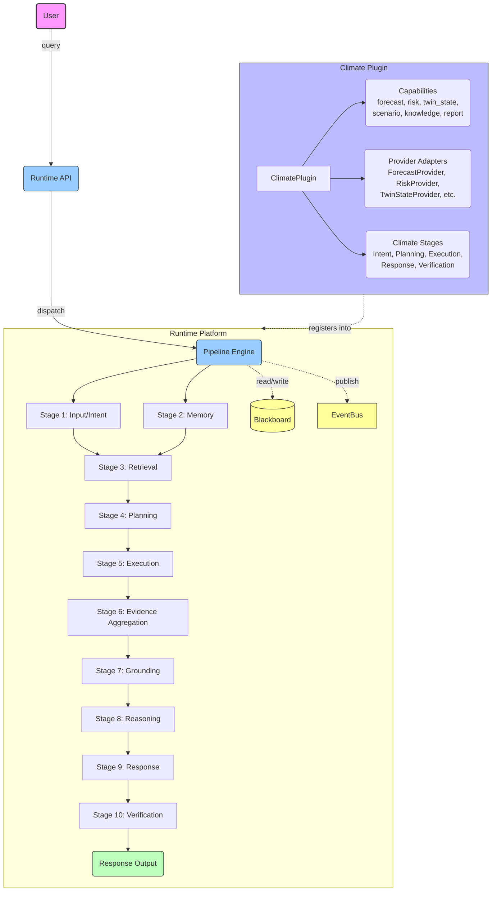

# System Architecture Overview

```mermaid
graph TD
    User(User) -->|query| API(Runtime API)
    API -->|dispatch| Pipeline(Pipeline Engine)

    subgraph Runtime[Runtime Platform]
        Pipeline --> Stage1[Stage 1: Input/Intent]
        Pipeline --> Stage2[Stage 2: Memory]

        Stage1 --> Stage3[Stage 3: Retrieval]
        Stage2 --> Stage3
        Stage3 --> Stage4[Stage 4: Planning]
        Stage4 --> Stage5[Stage 5: Execution]

        Stage5 --> Stage6[Stage 6: Evidence Aggregation]
        Stage6 --> Stage7[Stage 7: Grounding]
        Stage7 --> Stage8[Stage 8: Reasoning]
        Stage8 --> Stage9[Stage 9: Response]
        Stage9 --> Stage10[Stage 10: Verification]
        Stage10 --> Output(Response Output)

        Blackboard[(Blackboard)]
        EventBus[EventBus]

        Pipeline -.->|read/write| Blackboard
        Pipeline -.->|publish| EventBus
    end

    subgraph Climate[Climate Plugin]
        CP[ClimatePlugin]
        CP --> Caps(Capabilities\nforecast, risk, twin_state,\nscenario, knowledge, report)
        CP --> Provs(Provider Adapters\nForecastProvider, RiskProvider,\nTwinStateProvider, etc.)
        CP --> Stages(Climate Stages\nIntent, Planning, Execution,\nResponse, Verification)
    end

    Climate -.->|registers into| Runtime

    style User fill:#f9f,stroke:#333,stroke-width:2px
    style API fill:#9cf,stroke:#333
    style Pipeline fill:#9cf,stroke:#333
    style Output fill:#bfb,stroke:#333
    style Blackboard fill:#ff9,stroke:#333
    style EventBus fill:#ff9,stroke:#333
    style Climate fill:#bbf,stroke:#333
```
