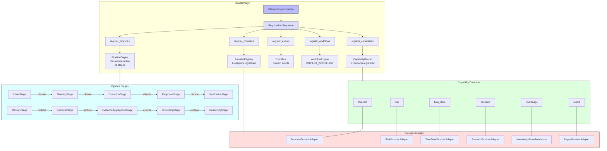

# Climate Plugin Architecture

```mermaid
graph TB
    subgraph ClimatePlugin[ClimatePlugin]
        CP[ClimatePlugin instance]
        CP --> Registration[Registration Sequence]
        Registration --> RegisterCapabilities[register_capabilities]
        Registration --> RegisterProviders[register_providers]
        Registration --> RegisterEvents[register_events]
        Registration --> RegisterWorkflows[register_workflows]
        Registration --> RegisterPipelines[register_pipelines]

        RegisterCapabilities --> CR[CapabilityRouter\n6 contracts registered]
        RegisterProviders --> PR[ProviderRegistry\n6 adapters registered]
        RegisterEvents --> EB[EventBus\ndomain events]
        RegisterWorkflows --> WE[WorkflowEngine\nCOPILOT_WORKFLOW]
        RegisterPipelines --> PE[PipelineEngine\nclimate.interactive\n11 stages]
    end

    subgraph Caps[Capability Contracts]
        F[forecast]
        R[risk]
        TS[twin_state]
        S[scenario]
        K[knowledge]
        Rep[report]
    end

    CR --- Caps

    subgraph Adapters[Provider Adapters]
        FA[ForecastProviderAdapter]
        RA[RiskProviderAdapter]
        TSA[TwinStateProviderAdapter]
        SA[ScenarioProviderAdapter]
        KA[KnowledgeProviderAdapter]
        RepA[ReportProviderAdapter]
    end

    PR --- Adapters

    F --- FA
    R --- RA
    TS --- TSA
    S --- SA
    K --- KA
    Rep --- RepA

    subgraph PipelineStages[Pipeline Stages]
        IS[IntentStage]
        MS[MemoryStage]
        RS[RetrievalStage]
        PS[PlanningStage]
        ES[ExecutionStage]
        EAS[EvidenceAggregationStage]
        GS[GroundingStage]
        RS2[ReasoningStage]
        RS3[ResponseStage]
        VS[VerificationStage]
    end

    PE --- PipelineStages

    IS -->|climate| PS
    PS -->|climate| ES
    ES -->|climate| RS3
    RS3 -->|climate| VS
    MS -->|runtime| RS
    RS -->|runtime| EAS
    EAS -->|runtime| GS
    GS -->|runtime| RS2

    style CP fill:#bbf,stroke:#333,stroke-width:2px
    style Registration fill:#ddf,stroke:#333
    style Caps fill:#dfd,stroke:#333
    style Adapters fill:#fdd,stroke:#333
    style PipelineStages fill:#dff,stroke:#333
```
