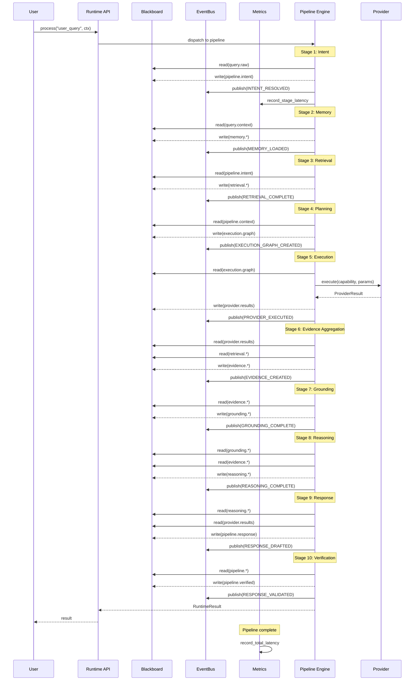

# Data Flow Diagram

```mermaid
sequenceDiagram
    participant User
    participant API as Runtime API
    participant BB as Blackboard
    participant EB as EventBus
    participant M as Metrics
    participant Pipeline as Pipeline Engine
    participant Prov as Provider

    User->>API: process("user_query", ctx)
    API->>Pipeline: dispatch to pipeline

    Note over Pipeline: Stage 1: Intent
    Pipeline->>BB: read(query.raw)
    Pipeline-->>BB: write(pipeline.intent)
    Pipeline->>EB: publish(INTENT_RESOLVED)
    Pipeline->>M: record_stage_latency

    Note over Pipeline: Stage 2: Memory
    Pipeline->>BB: read(query.context)
    Pipeline-->>BB: write(memory.*)
    Pipeline->>EB: publish(MEMORY_LOADED)

    Note over Pipeline: Stage 3: Retrieval
    Pipeline->>BB: read(pipeline.intent)
    Pipeline-->>BB: write(retrieval.*)
    Pipeline->>EB: publish(RETRIEVAL_COMPLETE)

    Note over Pipeline: Stage 4: Planning
    Pipeline->>BB: read(pipeline.context)
    Pipeline-->>BB: write(execution.graph)
    Pipeline->>EB: publish(EXECUTION_GRAPH_CREATED)

    Note over Pipeline: Stage 5: Execution
    Pipeline->>BB: read(execution.graph)
    Pipeline->>Prov: execute(capability, params)
    Prov-->>Pipeline: ProviderResult
    Pipeline-->>BB: write(provider.results)
    Pipeline->>EB: publish(PROVIDER_EXECUTED)

    Note over Pipeline: Stage 6: Evidence Aggregation
    Pipeline->>BB: read(provider.results)
    Pipeline->>BB: read(retrieval.*)
    Pipeline-->>BB: write(evidence.*)
    Pipeline->>EB: publish(EVIDENCE_CREATED)

    Note over Pipeline: Stage 7: Grounding
    Pipeline->>BB: read(evidence.*)
    Pipeline-->>BB: write(grounding.*)
    Pipeline->>EB: publish(GROUNDING_COMPLETE)

    Note over Pipeline: Stage 8: Reasoning
    Pipeline->>BB: read(grounding.*)
    Pipeline->>BB: read(evidence.*)
    Pipeline-->>BB: write(reasoning.*)
    Pipeline->>EB: publish(REASONING_COMPLETE)

    Note over Pipeline: Stage 9: Response
    Pipeline->>BB: read(reasoning.*)
    Pipeline->>BB: read(provider.results)
    Pipeline-->>BB: write(pipeline.response)
    Pipeline->>EB: publish(RESPONSE_DRAFTED)

    Note over Pipeline: Stage 10: Verification
    Pipeline->>BB: read(pipeline.*)
    Pipeline-->>BB: write(pipeline.verified)
    Pipeline->>EB: publish(RESPONSE_VALIDATED)

    Pipeline-->>API: RuntimeResult
    API-->>User: result

    Note over M: Pipeline complete
    M->>M: record_total_latency
```
