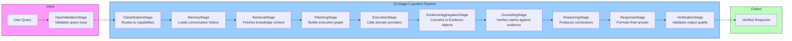

# Pipeline Flow Diagram

```mermaid
graph LR
    subgraph Input
        A[User Query] --> B[InputValidationStage<br/>Validates query input]
    end

    subgraph Processing[10-Stage Cognitive Pipeline]
        B --> C[ClassificationStage<br/>Routes to capabilities]
        C --> D[MemoryStage<br/>Loads conversation history]
        D --> E[RetrievalStage<br/>Fetches knowledge context]
        E --> F[PlanningStage<br/>Builds execution graph]
        F --> G[ExecutionStage<br/>Calls domain providers]
        G --> H[EvidenceAggregationStage<br/>Converts to Evidence objects]
        H --> I[GroundingStage<br/>Verifies claims against evidence]
        I --> J[ReasoningStage<br/>Produces conclusions]
        J --> K[ResponseStage<br/>Formats final answer]
        K --> L[VerificationStage<br/>Validates output quality]
    end

    subgraph Output
        L --> M[Verified Response]
    end

    style Input fill:#f9f,stroke:#333
    style Processing fill:#9cf,stroke:#333
    style Output fill:#bfb,stroke:#333
```
