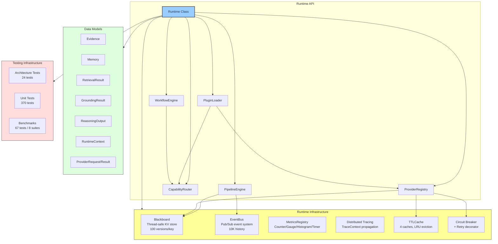

# Runtime Architecture

```mermaid
graph TB
    subgraph RuntimeAPI[Runtime API]
        RuntimeApp[Runtime Class]
        RuntimeApp --> PipelineEngine
        RuntimeApp --> PluginLoader
        RuntimeApp --> WorkflowEngine
        RuntimeApp --> CapabilityRouter
        RuntimeApp --> ProviderRegistry
    end

    subgraph Infrastructure[Runtime Infrastructure]
        Blackboard[Blackboard<br/>Thread-safe KV store<br/>100 versions/key]
        EventBus[EventBus<br/>Pub/Sub event system<br/>10K history]
        Metrics[MetricsRegistry<br/>Counter/Gauge/Histogram/Timer]
        Tracing[Distributed Tracing<br/>TraceContext propagation]
        Cache[TTLCache<br/>4 caches, LRU eviction]
        Reliability[Circuit Breaker<br/>+ Retry decorator]
    end

    subgraph Models[Data Models]
        Evidence[Evidence]
        Memory[Memory]
        Retrieval[RetrievalResult]
        Grounding[GroundingResult]
        Reasoning[ReasoningOutput]
        Context[RuntimeContext]
        Provider[ProviderRequest/Result]
    end

    subgraph Testing[Testing Infrastructure]
        ArchTests[Architecture Tests<br/>24 tests]
        UnitTests[Unit Tests<br/>370 tests]
        Benchmarks[Benchmarks<br/>67 tests / 8 suites]
    end

    RuntimeApp --> Infrastructure
    RuntimeApp --> Models
    RuntimeApp --> Testing

    PipelineEngine --> Blackboard
    PipelineEngine --> EventBus
    PluginLoader --> CapabilityRouter
    PluginLoader --> ProviderRegistry
    WorkflowEngine --> CapabilityRouter

    ProviderRegistry --> Blackboard
    ProviderRegistry --> Cache
    ProviderRegistry --> Reliability

    style RuntimeApp fill:#9cf,stroke:#333,stroke-width:2px
    style Infrastructure fill:#ff9,stroke:#333
    style Models fill:#dfd,stroke:#333
    style Testing fill:#fdd,stroke:#333
```
